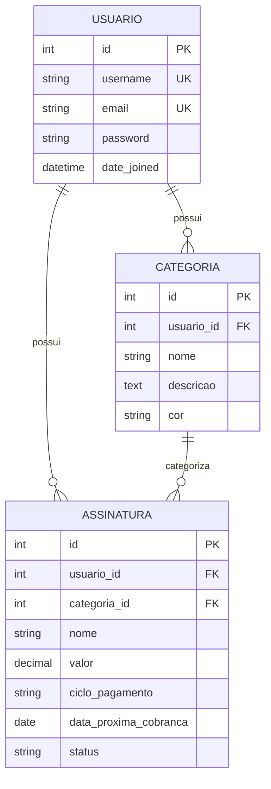

# Meu Bolso - Gerenciador de Assinaturas

Sistema web para gerenciamento de assinaturas e despesas recorrentes desenvolvido com Django.

## 👥 Equipe de Desenvolvimento

- Carlos Alves Lavor Neto
- Eric Dias Perin

## 📋 Sobre o Projeto

"Meu Bolso" é uma aplicação web utilitária focada em ajudar usuários a organizar, controlar e visualizar todas as suas despesas recorrentes, como:
- Serviços de streaming (Netflix, Spotify, etc.)
- Mensalidades de software
- Academias
- Outros serviços com pagamento recorrente

### Objetivos

- Resolver o problema da perda de controle sobre múltiplos pagamentos automáticos
- Oferecer uma visão centralizada de todas as despesas
- Prevenir cobranças inesperadas
- Auxiliar no planejamento financeiro pessoal

## 🗂️ Estrutura do Banco de Dados

O projeto implementa 3 entidades principais:

### 1. Usuario (Django User Model)
- Sistema de autenticação integrado do Django
- Campos: username, email, password, first_name, last_name

### 2. Categoria
- **Atributos:**
  - usuario (FK → Usuario)
  - nome (String, max 50 caracteres)
  - descricao (Text, opcional)
  - cor (String, formato hexadecimal)
  - data_criacao (DateTime)

- **Relacionamentos:**
  - Pertence a um único usuário (N:1)
  - Pode ter várias assinaturas (1:N)

### 3. Assinatura
- **Atributos:**
  - usuario (FK → Usuario)
  - categoria (FK → Categoria, opcional)
  - nome (String, max 100 caracteres)
  - descricao (Text, opcional)
  - valor (Decimal, 10 dígitos, 2 casas decimais)
  - moeda (String, default: "BRL")
  - ciclo_pagamento (Choices: MENSAL, TRIMESTRAL, SEMESTRAL, ANUAL)
  - data_primeira_cobranca (Date)
  - data_proxima_cobranca (Date)
  - dia_vencimento (Integer, 1-31)
  - status (Choices: ATIVA, PAUSADA, CANCELADA)
  - data_criacao (DateTime)
  - data_atualizacao (DateTime)
  - observacoes (Text, opcional)

- **Relacionamentos:**
  - Pertence a um único usuário (N:1)
  - Pode ter uma categoria (N:1, opcional)

### Métodos Importantes

#### Categoria
- `total_assinaturas()`: Retorna o número de assinaturas ativas

#### Assinatura
- `calcular_proxima_cobranca()`: Calcula automaticamente a próxima data de cobrança
- `valor_mensal()`: Converte o valor para base mensal
- `valor_anual()`: Converte o valor para base anual
- `dias_ate_proxima_cobranca()`: Retorna dias até a próxima cobrança
- `esta_vencida()`: Verifica se há cobrança vencida
- `atualizar_proxima_cobranca()`: Atualiza para o próximo ciclo

## 🚀 Instalação e Configuração

### Pré-requisitos

- Python 3.8 ou superior
- pip (gerenciador de pacotes Python)

### Passo a Passo

1. **Clone ou navegue até o diretório do projeto:**
```bash
cd /caminho/para/ProjetoTecWeb
```

2. **Crie e ative o ambiente virtual:**
```bash
python3 -m venv .venv
source .venv/bin/activate  # No Windows: .venv\Scripts\activate
```

3. **Instale as dependências:**
```bash
pip install -r requirements.txt
```

4. **Execute as migrações do banco de dados:**
```bash
python manage.py migrate
```

5. **Crie um superusuário para acessar o admin:**
```bash
python manage.py createsuperuser
```

6. **Inicie o servidor de desenvolvimento:**
```bash
python manage.py runserver
```

7. **Acesse a aplicação:**
   - Interface admin: http://127.0.0.1:8000/admin/
   - API (será implementada): http://127.0.0.1:8000/api/

## 📦 Dependências Principais

- **Django 5.2.7**: Framework web principal
- **python-dateutil 2.9.0**: Manipulação avançada de datas
- **PyPDF2 3.0.1**: Leitura de documentos PDF (usado no desenvolvimento)

## 📊 Diagramas ER

O projeto possui múltiplas versões do diagrama Entidade-Relacionamento:

- **`DIAGRAMA_ER.md`** - Diagrama em texto e ASCII (versão original)
- **`diagrama_er_mermaid.md`** - Diagrama visual interativo com Mermaid (renderiza no GitHub)
- **`diagrama_dbdiagram.md`** - Código para gerar diagrama visual em https://dbdiagram.io

### Visualização Rápida

O diagrama abaixo é renderizado automaticamente pelo GitHub usando Mermaid:



## 🎯 Funcionalidades Planejadas

### Backend
- ✅ Sistema de autenticação de usuários
- ✅ Models para Categoria e Assinatura
- ✅ Validações e cálculos automáticos
- ⏳ API RESTful para CRUD
- ⏳ Endpoints de autenticação
- ⏳ Sistema de notificações

### Frontend
- ⏳ Dashboard visual com gráficos
- ⏳ Formulários de gerenciamento
- ⏳ Sistema de filtros e busca
- ⏳ Interface responsiva

## 🗓️ Status do Projeto

**Fase Atual:** Modelagem e Backend Inicial (Ação 1)

### Concluído ✅
- Instalação do Django
- Criação do projeto "meubolso"
- Criação do app "assinaturas"
- Diagrama Entidade-Relacionamento
- Implementação dos Models (Categoria e Assinatura)
- Configuração do Django Admin
- Migrações do banco de dados

### Próximos Passos 🔄
- Desenvolvimento da API RESTful (Django REST Framework)
- Implementação do frontend
- Dashboard com visualizações
- Sistema de autenticação no frontend
- Testes automatizados

## 📝 Estrutura de Arquivos

```
ProjetoTecWeb/
├── .venv/                      # Ambiente virtual Python
├── assinaturas/                # App principal
│   ├── migrations/             # Migrações do banco de dados
│   ├── __init__.py
│   ├── admin.py               # Configuração do admin
│   ├── apps.py
│   ├── models.py              # Models (Categoria, Assinatura)
│   ├── tests.py
│   └── views.py
├── meubolso/                   # Configurações do projeto
│   ├── __init__.py
│   ├── asgi.py
│   ├── settings.py            # Configurações principais
│   ├── urls.py
│   └── wsgi.py
├── Acao1_ProjetoTecWeb.pdf    # Documento de requisitos
├── DIAGRAMA_ER.md             # Diagrama Entidade-Relacionamento
├── README.md                   # Este arquivo
├── manage.py                   # Script de gerenciamento Django
├── requirements.txt            # Dependências do projeto
└── db.sqlite3                  # Banco de dados SQLite
```

## 🎓 Informações Acadêmicas

**Instituição:** Universidade do Estado do Amazonas (UEA)  
**Escola:** Escola Superior de Tecnologia (EST)  
**Curso:** Engenharia da Computação  
**Disciplina:** Tecnologia Web  
**Ano:** 2025

## 📄 Licença

Este projeto é desenvolvido para fins acadêmicos.

---

**Desenvolvido com ❤️ por Carlos Alves Lavor Neto e Eric Dias Perin**
