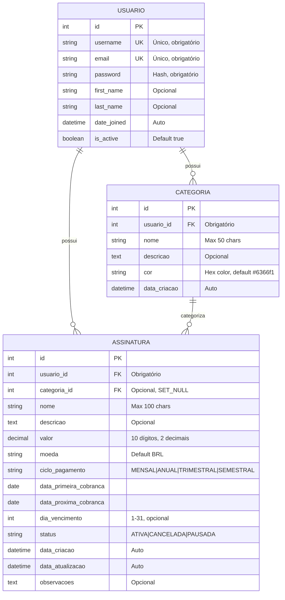
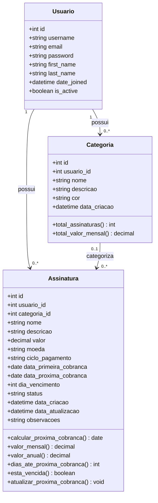
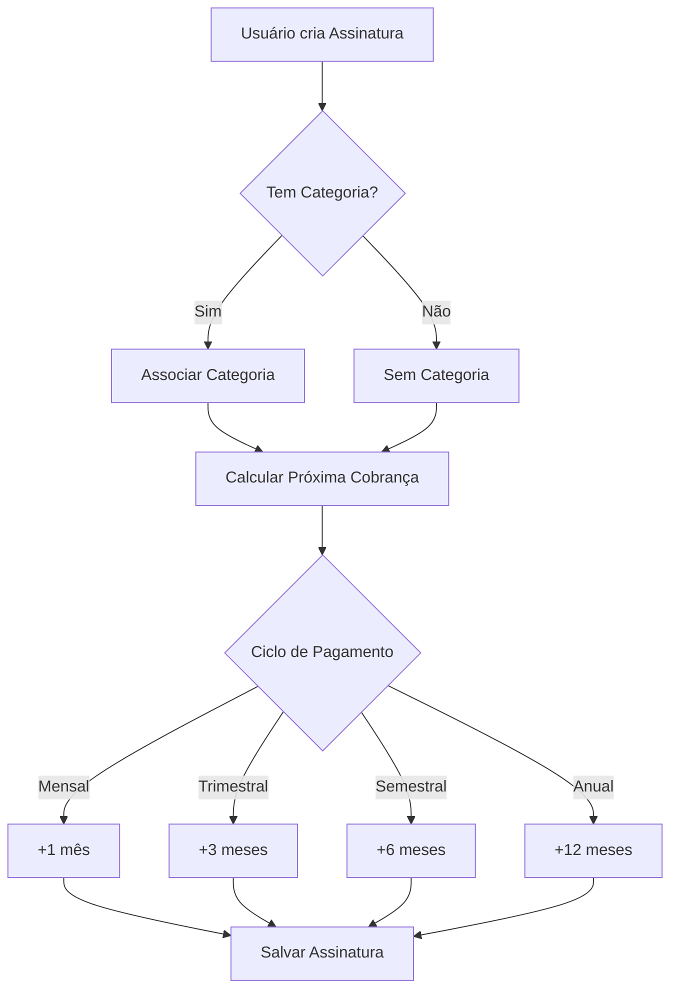
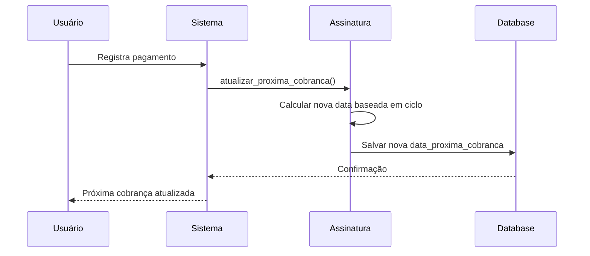

# Diagrama ER - Meu Bolso (Formato Mermaid)

Este diagrama pode ser visualizado diretamente no GitHub, VS Code (com extensão Mermaid), ou em https://mermaid.live

## Diagrama Entidade-Relacionamento

## Diagrama de Classes (UML)

## Visualização Online

Para visualizar estes diagramas de forma interativa:

1. **Mermaid Live Editor**: https://mermaid.live
   - Cole o código Mermaid acima
   - Visualize, edite e exporte como PNG/SVG

2. **GitHub**: Este arquivo já renderiza automaticamente no GitHub

3. **VS Code**: Instale a extensão "Markdown Preview Mermaid Support"

## Regras de Negócio Ilustradas

## Fluxo de Atualização de Cobrança

